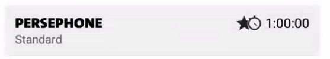

# Exercise 2

* percent dimension

To use percent, you need to set the following:
The dimension should be set to MATCH_CONSTRAINT (0dp)
The default should be set to percent app:layout_constraintWidth_default="percent" or app:layout_constraintHeight_default="percent"
(Note: this is necessary in 1.1-beta1 and 1.1-beta2, but will not be needed in following versions if the percent attribute is defined)
Then set the layout_constraintWidth_percent or layout_constraintHeight_percent attributes to a value between 0 and 1

* Baseline

* What happens on VIEW_GONE (there are also some features like:  layout_goneMarginTop that might be worthwhile mentioning)

* Ratio

