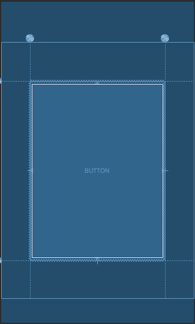

# Advanced Features

## Relative positioning

### Centering positioning and bias

A useful aspect of ConstraintLayout is in how it deals with "impossible"
constrains. For example, if we have something like:

```
<android.support.constraint.ConstraintLayout ...>
             <Button android:id="@+id/button" ...
                 app:layout_constraintStart_toStartOf="parent"
                 app:layout_constraintEnd_toEndOf="parent/>
</>
```
         
     
Unless the ConstraintLayout happens to have the exact same size as the Button,
 both constraints cannot be satisfied at the same time (both sides cannot be
  where we want them to be).


What happens in this case is that the constraints act like opposite forces
pulling the widget apart equally; such that the widget will end up
being centered in the parent container. This will apply similarly for vertical
constraints.

### Bias
The default when encountering such opposite constraints is to center the widget;
but you can tweak the positioning to favor one side over another using the bias
 attributes:

* `layout_constraintHorizontal_bias`

* `layout_constraintVertical_bias`


For example the following will make the left side with a 30% bias
instead of the default 50%, such that the left side will be
shorter, with the widget leaning more toward the left side:

```
<android.support.constraint.ConstraintLayout ...>
             <Button android:id="@+id/button" ...
                 app:layout_constraintHorizontal_bias="0.3"
                 app:layout_constraintStart_toStartOf="parent"
                 app:layout_constraintEnd_toEndOf="parent//>
</>
```

### Using editor


## Chains
Chains provide group-like behavior in a single axis
(horizontally or vertically). The other axis can be constrained independently.

### Creating a chain
A set of widgets are considered a chain if they are linked
 together via a bi-directional connection.


### Chain heads
Chains are controlled by attributes set on the first element
of the chain (the "head" of the chain):


```
<android.support.constraint.ConstraintLayout ...>
             <Button android:id="@+id/button1" ...
                app:layout_constraintEnd_toStartOf="@+id/button2"
                app:layout_constraintStart_toStartOf="parent"/>

             <Button android:id="@+id/button2" ...
                app:layout_constraintStart_toEndOf="button1"
                app:layout_constraintEnd_toEndOf="parent"/>
</>
```

The head is the left-most widget for horizontal chains,
 and the top-most widget for vertical chains.

### Chain Style
When setting the attribute
`layout_constraintHorizontal_chainStyle` or
`layout_constraintVertical_chainStyle` on the
first element of a chain, the behavior of the chain
will change according to the specified style
(default is `CHAIN_SPREAD`).

* `CHAIN_SPREAD` -- the elements will be spread out (default style)

* Weighted chain -- in `CHAIN_SPREAD` mode, if some widgets are set to `MATCH_CONSTRAINT`, they will split the available space

* `CHAIN_SPREAD_INSIDE` -- similar, but the endpoints of the chain will not be spread out

* `CHAIN_PACKED` -- the elements of the chain will be packed together. The horizontal or vertical bias attribute of the child will then affect the positioning of the packed elements


###  Weighted chains
The default behavior of a chain is to spread the elements
equally in the available space. If one or more elements
are using `MATCH_CONSTRAINT`, they will use the available
empty space (equally divided among themselves).
The attribute `layout_constraintHorizontal_weight` and
`layout_constraintVertical_weight` will control how the
space will be distributed among the elements using
`MATCH_CONSTRAINT`. For exemple, on a chain containing two elements
 using `MATCH_CONSTRAINT`, with the first element using a weight of
 2 and the second a weight of 1, the space occupied by
 the first element will be twice that of the second element.

### Using editor


## Gudielines

Guidelines are invisible view components (they are marked as `View.GONE`)
only used for layout purposes. They only work within a `ConstraintLayout`.

A Guideline can be either horizontal or vertical:

* Vertical Guidelines have a width of zero and the height of their ConstraintLayout parent
* Horizontal Guidelines have a height of zero and the width of their ConstraintLayout parent

Positioning a Guideline is possible in three different ways:

* specifying a fixed distance from the left or the top of a layout `layout_constraintGuide_begin`
* specifying a fixed distance from the right or the bottom of a layout `layout_constraintGuide_end`
* specifying a percentage of the width or the height of a layout `layout_constraintGuide_percent`

Widgets can then be constrained to a Guideline, allowing multiple
 widgets to be positioned easily from one Guideline, or allowing reactive
 layout behavior by using percent positioning.


Example of a Button constrained to a vertical Guideline:
```
<android.support.constraint.ConstraintLayout
        xmlns:android="http://schemas.android.com/apk/res/android"
        xmlns:app="http://schemas.android.com/apk/res-auto"
        xmlns:tools="http://schemas.android.com/tools"
        android:layout_width="match_parent"
        android:layout_height="match_parent">

    <android.support.constraint.Guideline
            android:layout_width="wrap_content"
            android:layout_height="wrap_content"
            android:id="@+id/guideline"
            app:layout_constraintGuide_begin="100dp"
            android:orientation="vertical"/>

    <Button
            android:text="Button"
            android:layout_width="wrap_content"
            android:layout_height="wrap_content"
            android:id="@+id/button"
            app:layout_constraintLeft_toLeftOf="@+id/guideline"
            android:layout_marginTop="16dp"
            app:layout_constraintTop_toTopOf="parent" />

</android.support.constraint.ConstraintLayout>
```


More advanced example of using Guidelines (instead of PercentLayout)

```
 <android.support.constraint.ConstraintLayout
         xmlns:android="http://schemas.android.com/apk/res/android"
         xmlns:app="http://schemas.android.com/apk/res-auto"
         android:layout_width="match_parent"
         android:layout_height="match_parent">

     <android.support.constraint.Guideline
         android:layout_width="wrap_content"
         android:layout_height="wrap_content"
         android:id="@+id/left_guideline"
         app:layout_constraintGuide_percent=".15"
         android:orientation="vertical"/>

     <android.support.constraint.Guideline
         android:layout_width="wrap_content"
         android:layout_height="wrap_content"
         android:id="@+id/right_guideline"
         app:layout_constraintGuide_percent=".85"
         android:orientation="vertical"/>

     <android.support.constraint.Guideline
         android:layout_width="wrap_content"
         android:layout_height="wrap_content"
         android:id="@+id/top_guideline"
         app:layout_constraintGuide_percent=".15"
         android:orientation="horizontal"/>

     <android.support.constraint.Guideline
         android:layout_width="wrap_content"
         android:layout_height="wrap_content"
         android:id="@+id/bottom_guideline"
         app:layout_constraintGuide_percent=".85"
         android:orientation="horizontal"/>

     <Button
         android:text="Button"
         android:layout_width="0dp"
         android:layout_height="0dp"
         android:id="@+id/button"
         app:layout_constraintLeft_toLeftOf="@+id/left_guideline"
         app:layout_constraintRight_toRightOf="@+id/right_guideline"
         app:layout_constraintTop_toTopOf="@+id/top_guideline"
         app:layout_constraintBottom_toBottomOf="@+id/bottom_guideline" />

 </android.support.constraint.ConstraintLayout>
 ```




## Barriers
**_Added in 1.1_**

 A Barrier references multiple widgets as input, and creates a virtual guideline based on the most extreme widget on the specified side.
 For example, a left barrier will align to the left of all the referenced views.

 Let's have two buttons, `@id/button1` and `@id/button2`. The constraint_referenced_ids field will reference them by
 simply having them as comma-separated list

```
 <android.support.constraint.Barrier
              android:id="@+id/barrier"
              android:layout_width="wrap_content"
              android:layout_height="wrap_content"
              app:barrierDirection="end"
              app:constraint_referenced_ids="button1,button2" />
 ```

We will have the following result:


If the widgets dimensions change, the barrier will automatically move according to its direction
to get the most extreme widget:


Other widgets can then be constrained to the barrier itself,
instead of the individual widget. This allows a layout to automatically
adapt on widget dimension changes (e.g. different languages will end up
with different length for similar worlds).


[_constraintlayout.com_](https://constraintlayout.com/basics/barriers.html)
## Placeholder
**_Added in 1.1_**

 A Placeholder provides a virtual object which can position an existing object.

 When the id of another view is set on a placeholder (using `setContentId()`),
  the placeholder effectively becomes the content view.
   If the content view exist on the screen it is treated as gone from its original location.

 The content view is positioned using the layout of the parameters of the Placeholder
 (the Placeholder is simply constrained in the layout like any other view).


[_androidkt.com_](http://androidkt.com/constraintlayout/)


## Circular positioning
**_Added in 1.1_**

You can constrain a widget center relative to another widget center, at an angle and a distance. This allows you to position a widget on a circle.
 The following attributes can be used:

* `layout_constraintCircle` : references another widget id
* `layout_constraintCircleRadius` : the distance to the other widget center
* `layout_constraintCircleAngle` : which angle the widget should be at (in degrees, from 0 to 360)

 

```
<Button android:id="@+id/buttonA" ... />
  <Button android:id="@+id/buttonB" ...
      app:layout_constraintCircle="@+id/buttonA"
      app:layout_constraintCircleRadius="100dp"
      app:layout_constraintCircleAngle="45" />
```


## Groups
**_Added in 1.1_**

This class controls the visibility of a set of referenced widgets.
Widgets are referenced by being added to a comma separated list of ids, e.g:

```
     <android.support.constraint.Group
              android:id="@+id/group"
              android:layout_width="wrap_content"
              android:layout_height="wrap_content"
              android:visibility="visible"
              app:constraint_referenced_ids="button4,button9" />
```

The visibility of the group will be applied to the referenced widgets.
It's a convenient way to easily hide/show a set of widgets without having to
maintain this set programmatically.

### Multiple groups
Multiple groups can reference the same widgets -- in that case,
the XML declaration order will define the final visibility state
(the group declared last will have the last word).


### TODO
MATCH_CONSTRAINT dimensions (Added in 1.1)
When a dimension is set to MATCH_CONSTRAINT, the default behavior is to have the resulting size take all the available space. Several additional modifiers are available:

layout_constraintWidth_min and layout_constraintHeight_min : will set the minimum size for this dimension
layout_constraintWidth_max and layout_constraintHeight_max : will set the maximum size for this dimension
layout_constraintWidth_percent and layout_constraintHeight_percent : will set the size of this dimension as a percentage of the parent
