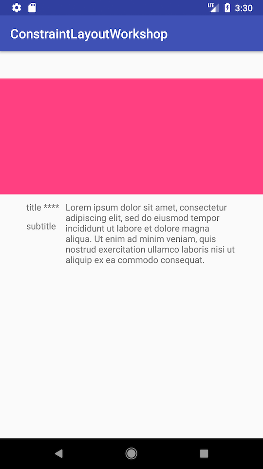
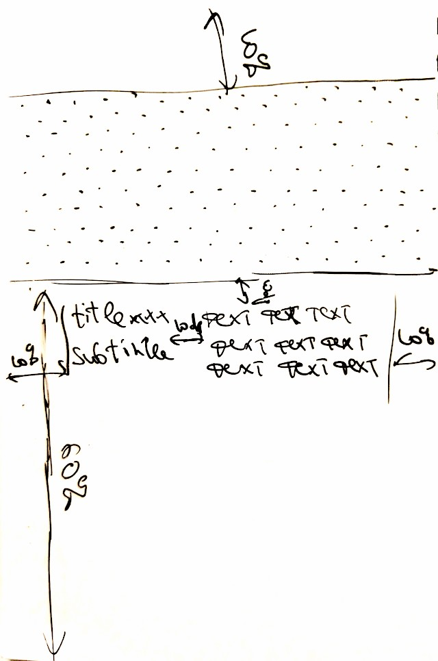

# Migrating legacy layout

 

* layout has been already implemented in a "usual" way, leaving out some of requested measurements in `layout/exercise_3.xml`
* no nested layouts required
* `title` has variable size and it shouldn't overlap with text
* keep existing ids
* use persent dimensions instead of absolute ones

