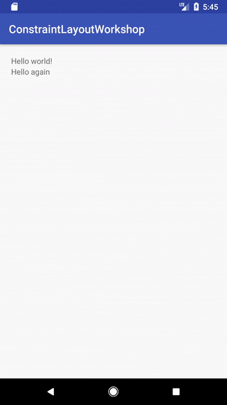
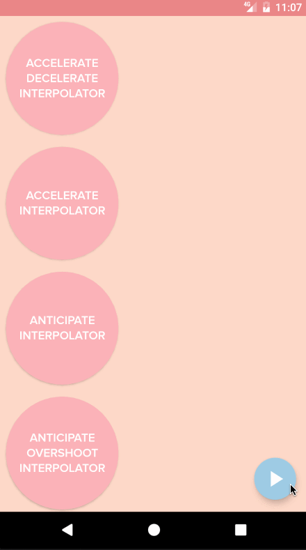
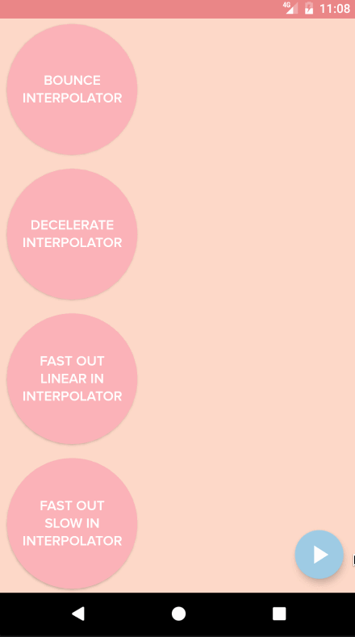

# Animations

### Overview

The user interface of an activity often changes in response to user input and other events. For example, an activity that contains a form where users can type search queries can hide the form when the user submits it and show a list of search results in its place.

To provide visual continuity in these situations, you can animate changes between different view hierarchies in your user interface. These animations give users feedback on their actions and help them learn how your app works.

Android includes the transitions framework, which enables you to easily animate changes between two view hierarchies. The framework animates the views at runtime by changing some of their property values over time. The framework includes built-in animations for common effects and lets you create custom animations and transition lifecycle callbacks.

We will focus on animations inside single view, so called `delayed transitions`.

### Simple transitions

Simplest use case of `delayed transitions` is shown below

```
    boolean visible;

    @Override
    public void onClick(View v) {
        TransitionManager.beginDelayedTransition(transitionsContainer);
        visible = !visible;
        text.setVisibility(visible ? View.VISIBLE : View.GONE);
    }
 ```


[andkulikov](https://medium.com/@andkulikov/animate-all-the-things-transitions-in-android-914af5477d50)

Constraint layout gives a opportunity to adjust whole
layout of the view by changing only few parameters

```
 TransitionManager.beginDelayedTransition(ConstraintLayout)

 top.minHeight = 200
```

```
  <TextView
        android:id="@+id/top"
        android:layout_width="wrap_content"
        android:layout_height="wrap_content"
        android:text="Hello world!"/>

    <TextView
        android:id="@+id/bottom"
        android:layout_width="wrap_content"
        android:layout_height="wrap_content"
        app:layout_constraintTop_toBottomOf="@+id/top"
        android:text="Hello again"/>
```





### Constraint Set

`Constraint Set` describes
a set of constraints to be used with ConstraintLayout.
It lets you create and save constraints programmatically,
and apply them to an existing ConstraintLayout.
ConstraintsSet can be created in various ways:

* Manually
`c = new ConstraintSet(); c.connect(....);`
* from a layout file
`c.clone(context, R.layout.layout1);`
* copying from current ConstraintLayout
`c.clone(constraintLayout);`

For instance:

```
    private var constraintSet1 = ConstraintSet() // create a Constraint Set
    private var constraintSet2 = ConstraintSet() // create a Constraint Set
    private var showFirstState = true

    fun onCreate(savedInstanceState: Bundle?) {
        super.onCreate(savedInstanceState)
        setContentView(R.layout.state1)
        constraintSet2.clone(context, R.layout.state2) // get constraints from layout
        constraintSet1.clone(constraintLayout) // get constraints from ConstraintSet
    }

    fun onClick() {
        TransitionManager.beginDelayedTransition(constraintLayout)
        showFirstState = !showFirstState
        if (showFirstState) {
            constraintSet1.applyTo(constraintLayout) // set new constraints
        } else {
            constraintSet2.applyTo(constraintLayout) // set new constraints
        }
    }
```

#### **There's no need to define style of views, if layout will only be used for initializing `ConstraintSet`.  Only layout-related parameters will be taken: `width`, `height`, `visibility`, `constraints` etc**

### Custom transition, Interpolator

By default, `TransitionManager` will move and resize along the straight path with the linear interpolation
To make animation more appealing, custom transition and custom interpolator should be specified.

```
  TransitionManager.beginDelayedTransition(layout, ChangeBounds().apply { interpolator = OvershootInterpolator() })
```

Built-in transitions:
* `AutoTransition` - Default transition. Fade out, move and resize, and fade in views, in that order.
* `Fade` - fades in, fades out or does a fade out followed by a fade in
* `ChangeBounds` - Moves and resizes views.

Built-in interpolators:






[Amanda Hill @ Thoughtbot](https://robots.thoughtbot.com/android-interpolators-a-visual-guide)
