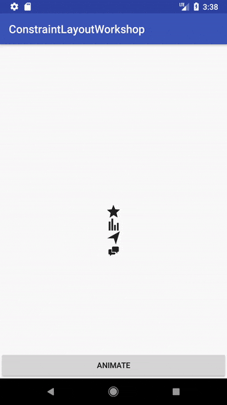
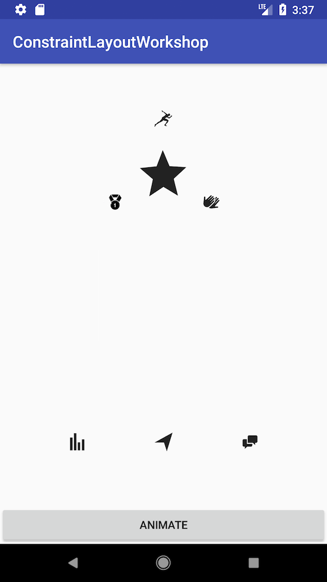
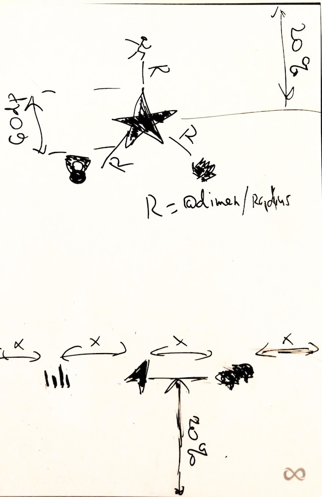

# Constraint layout animation

 

* first scene is already implemented in `layout/exercise_4.xml`
* define second scene in `layout/exercise_4_1.xml`
* set up constraint sets in `exercise4.ExerciseFour.initializeConstraintSets()`
* define add custom transition and interpolator in `exercise4.ExerciseFour.createTransition`
